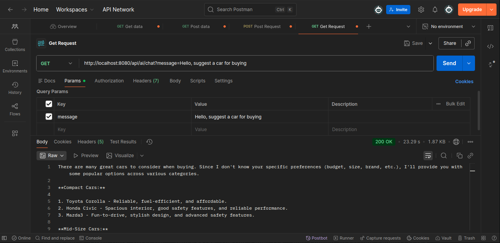
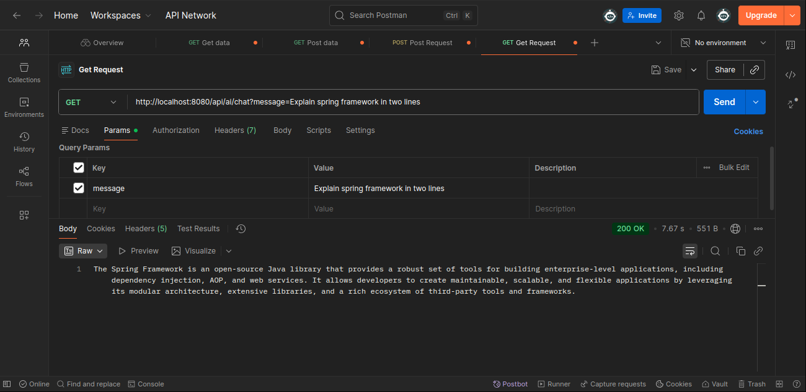
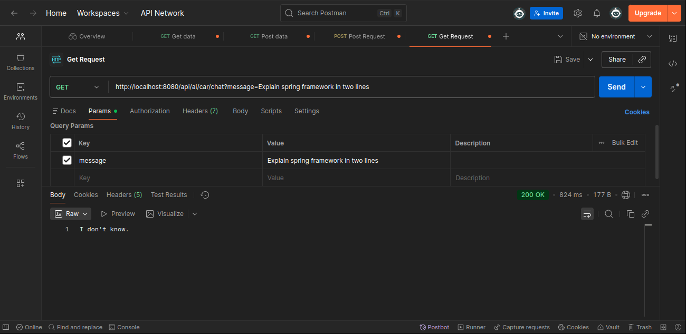

# Spring AI Chat Application

This is a simple Spring Boot application that integrates with AI using Ollama to provide a chat endpoint. It allows users to send messages and receive AI-generated responses via a REST API.

## Features

- RESTful API endpoint for chatting with an AI model.
- Configurable AI model via Spring AI and Ollama.
- Easy setup with local Ollama instance.

## Prerequisites

- Java 17 or higher
- Maven 3.6 or higher
- Ollama installed and running locally

## Setup and Installation

### 1. Install Ollama

Ollama is required to run the AI model locally. Follow these steps to install it on your system:

```bash
curl -fsSL https://ollama.com/install.sh | sh
```

This command downloads and installs Ollama.

### 2. Start Ollama Service

After installation, start the Ollama service:

```bash
ollama serve
```

**Note:** If you encounter an error like "listen tcp 127.0.0.1:11434: bind: address already in use", it means Ollama is already running. You can check with:

```bash
sudo lsof -i :11434
```

### 3. Pull the Required Model

Pull the `llama3.2:1b` model used by the application:

```bash
ollama pull llama3.2:1b
```

This downloads the model files. You can verify the installed models with:

```bash
ollama list
```

### 4. Build and Run the Application

Clone or navigate to the project directory, then build and run the Spring Boot application:

```bash
mvn clean install
mvn spring-boot:run
```

The application will start on `http://localhost:8080` by default.

## Configuration

The application is configured via `src/main/resources/application.yml`:

```yaml
spring:
  application:
    name: ai-with-spring
  ai:
    ollama:
      base-url: http://localhost:11434
      chat:
        options:
          model: llama3.2:1b
```

- `base-url`: URL of the local Ollama instance.
- `model`: The AI model to use (must be pulled via Ollama).

## Usage

Once the application is running, you can interact with the AI via the `/api/ai/chat` endpoint.

### Example Request

Send a GET request to the chat endpoint with a message parameter:

```bash
curl "http://localhost:8080/api/ai/chat?message=Hello, suggest a car for buying"
```

Replace `Hello, suggest a car for buying` with your desired message.

### Response

The endpoint returns a plain text string with the AI-generated reply (not JSON, as it's a simple chat response).

#### Response Example:



## API Endpoints

### 1. Generic AI Endpoint

- `GET /api/ai/chat?message={your_message}`: Generates an AI response to any question without restrictions.

**Example:**
```bash
curl "http://localhost:8080/api/ai/chat?message=Explain spring framework in two lines"
```

The generic endpoint has no topic restrictions and will answer any question, including those outside the application's scope.



### 2. Specialized Car Endpoint with System Role

- `GET /api/ai/car/chat?message={your_message}`: Generates responses **only** about cars. Questions outside this scope return "I don't know."

#### Understanding System Role

A **system role** (or system prompt) is an instruction given to an AI model at the beginning of a conversation to define:

- **Behavior**: How the model should respond to questions (e.g., step-by-step, short, with code, with examples, etc.)
- **Personality**: The tone and style of responses (e.g., friendly, formal, funny, Strict, etc.)
- **Boundaries**: What topics the model should and should not answer (e.g., Topics to avoid, Rules to follow, 
funny, Safety constraints, etc.)

This ensures the model stays focused on its intended purpose throughout the conversation.

#### Example: Using the Car-Scoped Endpoint

**Request (Out of Scope Question):**
```bash
curl "http://localhost:8080/api/ai/car/chat?message=Explain spring framework in two lines"
```

**Response:**
```text
I don't know
```



**Explanation:** The CarController uses a system role that restricts responses to car-related topics only. 
Since "Explain spring framework" is outside the scope, the model declines to answer.
