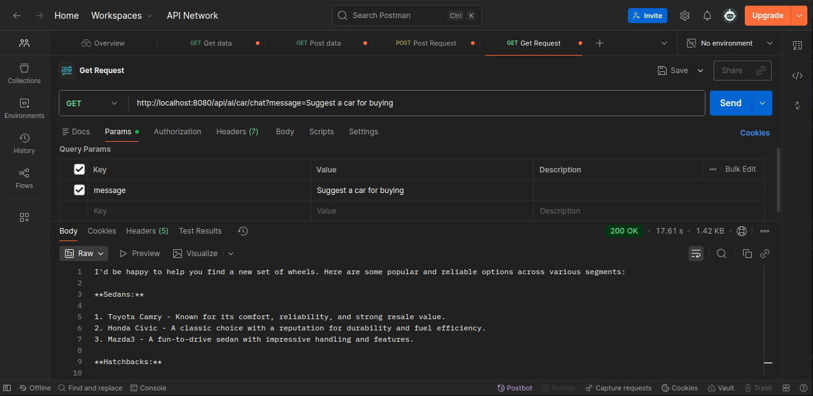
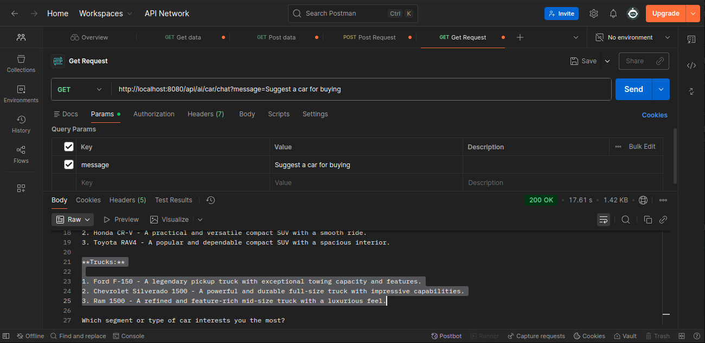
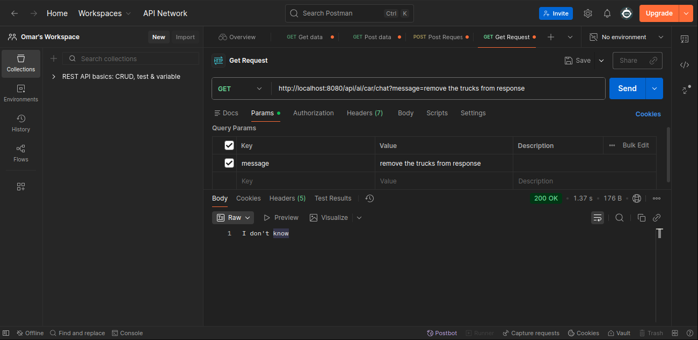
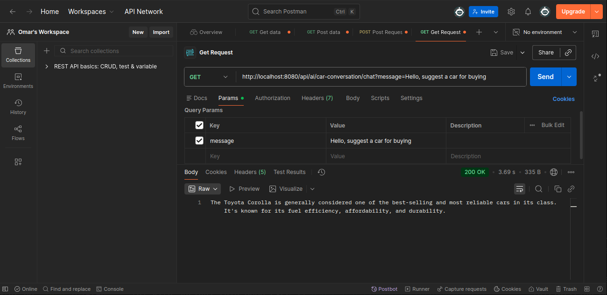
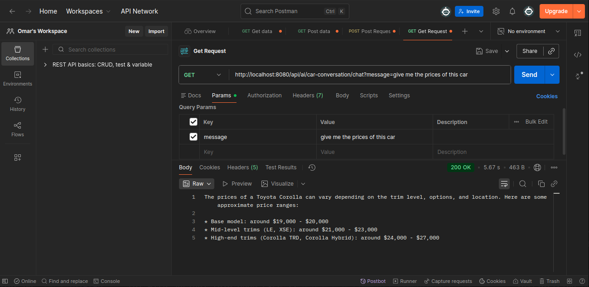

# Spring AI Chat Application

This is a simple Spring Boot application that integrates with AI using Ollama to provide a chat endpoint. It allows users to send messages and receive AI-generated responses via a REST API.

## Features

- RESTful API endpoint for chatting with an AI model.
- Configurable AI model via Spring AI and Ollama.
- Easy setup with local Ollama instance.

## Prerequisites

- Java 17 or higher
- Maven 3.6 or higher
- Ollama installed and running locally

## Setup and Installation

### 1. Install Ollama

Ollama is required to run the AI model locally. Follow these steps to install it on your system:

```bash
curl -fsSL https://ollama.com/install.sh | sh
```

This command downloads and installs Ollama.

### 2. Start Ollama Service

After installation, start the Ollama service:

```bash
ollama serve
```

**Note:** If you encounter an error like "listen tcp 127.0.0.1:11434: bind: address already in use", it means Ollama is already running. You can check with:

```bash
sudo lsof -i :11434
```

### 3. Pull the Required Model

Pull the `llama3.2:1b` model used by the application:

```bash
ollama pull llama3.2:1b
```

This downloads the model files. You can verify the installed models with:

```bash
ollama list
```

### 4. Build and Run the Application

Clone or navigate to the project directory, then build and run the Spring Boot application:

```bash
mvn clean install
mvn spring-boot:run
```

The application will start on `http://localhost:8080` by default.

## Configuration

The application is configured via `src/main/resources/application.yml`:

```yaml
spring:
  application:
    name: ai-with-spring
  ai:
    ollama:
      base-url: http://localhost:11434
      chat:
        options:
          model: llama3.2:1b
```

- `base-url`: URL of the local Ollama instance.
- `model`: The AI model to use (must be pulled via Ollama).

## Usage

Once the application is running, you can interact with the AI via the `/api/ai/chat` endpoint.

### Example Request

Send a GET request to the chat endpoint with a message parameter:

```bash
curl "http://localhost:8080/api/ai/chat?message=Hello, suggest a car for buying"
```

Replace `Hello, suggest a car for buying` with your desired message.

### Response

The endpoint returns a plain text string with the AI-generated reply (not JSON, as it's a simple chat response).

#### Response Example:


## API Endpoints

### 1. Generic AI Endpoint

- `GET /api/ai/chat?message={your_message}`: Generates an AI response to any question without restrictions.

**Example:**
```bash
curl "http://localhost:8080/api/ai/chat?message=Explain spring framework in two lines"
```

The generic endpoint has no topic restrictions and will answer any question, including those outside the application's scope.


### 2. Specialized Car Endpoint with System Role

- `GET /api/ai/car/chat?message={your_message}`: Generates responses **only** about cars. Questions outside this scope return "I don't know."

#### Understanding System Role

A **system role** (or system prompt) is an instruction given to an AI model at the beginning of a conversation to define:

- **Behavior**: How the model should respond to questions (e.g., step-by-step, short, with code, with examples, etc.)
- **Personality**: The tone and style of responses (e.g., friendly, formal, funny, Strict, etc.)
- **Boundaries**: What topics the model should and should not answer (e.g., Topics to avoid, Rules to follow, 
funny, Safety constraints, etc.)

This ensures the model stays focused on its intended purpose throughout the conversation.

#### Example: Using the Car-Scoped Endpoint

**Request (Out of Scope Question):**
```bash
curl "http://localhost:8080/api/ai/car/chat?message=Explain spring framework in two lines"
```

**Response:**
```text
I don't know
```


**Explanation:** The CarController uses a system role that restricts responses to car-related topics only. 
Since "Explain spring framework" is outside the scope, the model declines to answer.


## Conversation History and Persistence

### Limitation of Stateless Endpoints

The previous endpoints (`/api/ai/chat` and `/api/ai/car/chat`) are **stateless**, meaning each request is independent and the AI does not remember previous interactions. This can lead to inconsistent or repetitive conversations.

#### Example: Car Suggestion Conversation

**Initial Request:**
```bash
curl "http://localhost:8080/api/ai/car/chat?message=Suggest me a car to buy"
```

**Response:**
```text
I'd be happy to help you find a new set of wheels. Here are some popular and reliable options across various segments:

**Sedans:**
1. Toyota Camry - Known for its comfort, reliability, and strong resale value.
2. Honda Civic - A classic choice with a reputation for durability and fuel efficiency.
3. Mazda3 - A fun-to-drive sedan with impressive handling and features.

**Hatchbacks:**
1. Volkswagen Golf - A versatile and feature-packed hatchback with a great balance of performance and comfort.
2. Hyundai Elantra - A solid, affordable option with a range of engine options and premium features.
3. Kia Rio - A budget-friendly choice with a spacious interior and impressive fuel economy.

**SUVs/Crossovers:**
1. Subaru Outback - A rugged and reliable all-weather SUV with plenty of cargo space.
2. Honda CR-V - A practical and versatile compact SUV with a smooth ride.
3. Toyota RAV4 - A popular and dependable compact SUV with a spacious interior.

**Trucks:**
1. Ford F-150 - A legendary pickup truck with exceptional towing capacity and features.
2. Chevrolet Silverado 1500 - A powerful and durable full-size truck with impressive capabilities.
3. Ram 1500 - A refined and feature-rich mid-size truck with a luxurious feel.

Which segment or type of car interests you the most?
```



**Follow-up Request (Attempting to Refine):**
```bash
curl "http://localhost:8080/api/ai/car/chat?message=I don't want trucks, remove them from the list"
```

**Problem:** The AI does not remember the previous context and cannot refine the suggestions based on prior preferences.





### Solution: Conversation-Persistent Endpoint

To address this limitation, we implemented a **conversation-persistent endpoint** (`/api/ai/car-conversation/chat`) that maintains conversation history across requests.

#### Implementation Details

The endpoint uses a list of `Message` objects to store conversation history:

- **SystemMessage**: Defines the AI's role and boundaries (e.g., "You are a car expert assistant. You must ONLY answer questions related to cars...")
- **UserMessage**: Stores user inputs
- **AssistantMessage**: Stores AI responses

Each new request appends the user's message to the conversation list, generates a response using all previous messages as context, and saves the AI's reply for future context.

#### API Endpoint

- `GET /api/ai/car-conversation/chat?message={your_message}`: This endpoint maintains the conversation context for car-related discussions. Each message you send is added to the conversation history, allowing the AI to remember previous questions and answers.

### Example: Multi-Turn Conversation

Suppose you want to get a car recommendation and then ask a follow-up question about the suggested car.

1. **First Request:**
   ```bash
   curl "http://localhost:8080/api/ai/car-conversation/chat?message=Hello, suggest a car for buying"
   ```
   **Response:**
   > The Toyota Corolla is generally considered one of the best-selling and most reliable cars in its class. It's known for its fuel efficiency, affordability, and durability.

   

2. **Follow-up Request:**
   ```bash
   curl "http://localhost:8080/api/ai/car-conversation/chat?message=give me the prices of this car"
   ```
   **Response:**
   > The prices of a Toyota Corolla can vary depending on the trim level, options, and location. Here are some approximate price ranges:
   >
   > * Base model: around $19,000 - $20,000
   > * Mid-level trims (LE, XSE): around $21,000 - $23,000
   > * High-end trims (Corolla TRD, Corolla Hybrid): around $24,000 - $27,000

   

**Explanation:**
- The AI remembers that the previous car discussed was the Toyota Corolla, so when you ask for the prices, it provides relevant information about that specific car.
- This persistent context enables a more natural, multi-turn conversation, similar to how you would interact with a human expert.

